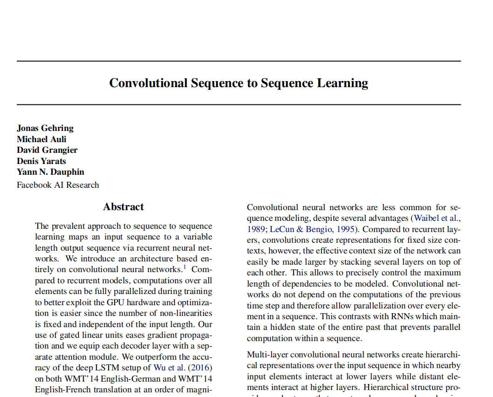

# Conv-Seq2Seq
This is my attempt to implement the "Convolutional Sequence to Sequence Learning"
paper published by FacebookAI in 2017 using PyTorch. My implementation has been
done fully using PyTorch and PyTorchAudio.

The aim of this paper is to use a Convolution networks as a new architecture
for translation. One of the major defects of Seq2Seq models is that it can’t
process words in parallel. For a large corpus of text, this increases the time
spent translating the text. CNNs can help us solve this problem as we can 
parallelize them. Accordinng to the paper, Conv Seq2Seq outperformed the
Attention model on both WMT’14 English-German and WMT’14 English-French
translation while achieving faster results.

    

