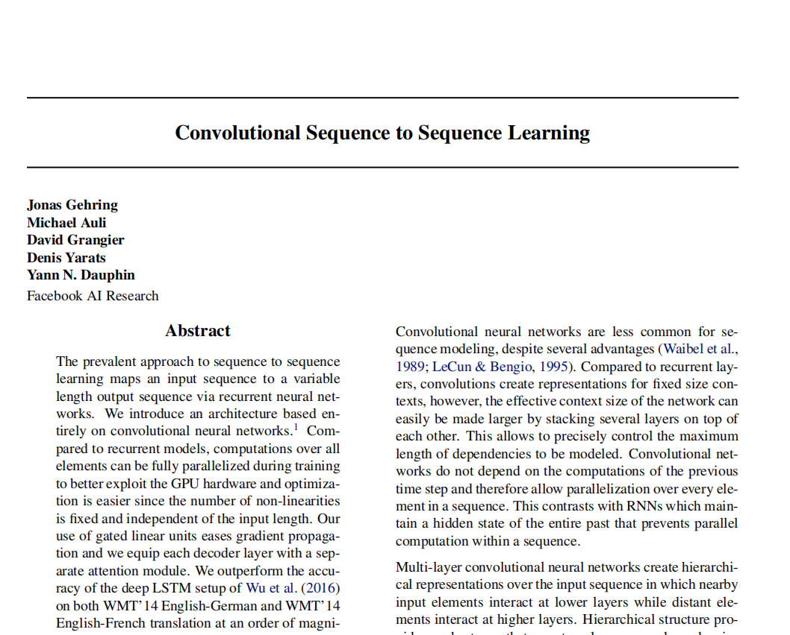
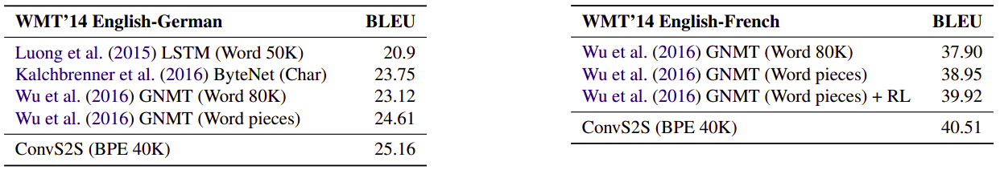
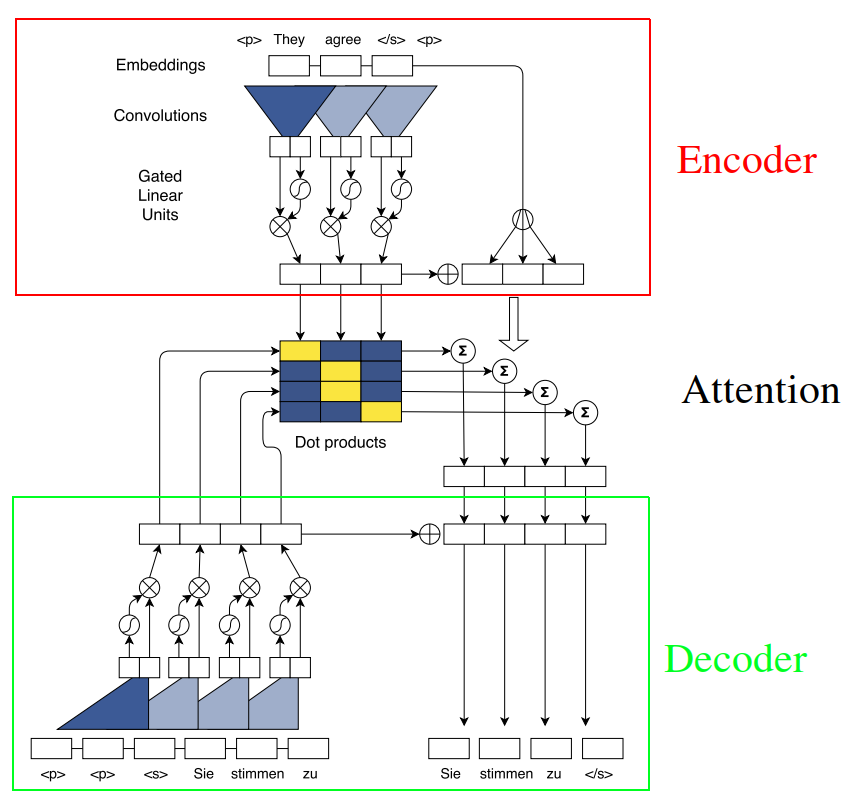

# Conv-Seq2Seq
This is my attempt to implement the "[Convolutional Sequence to Sequence
Learning](https://arxiv.org/pdf/1705.03122.pdf)" paper published by FacebookAI
in 2017. My implementation has been done fully using PyTorch and PyTorchText.

The aim of this paper is to use a Convolution networks as a new architecture
for translation. One of the major defects of Seq2Seq models is that it can’t
process words in parallel. For a large corpus of text, this increases the time
spent translating the text. CNNs can help us solve this problem as we can 
parallelize them. 

<div align="Center">
    <a href="https://arxiv.org/pdf/1705.03122.pdf">  </a>
</div>

According to the paper, Conv Seq2Seq outperformed the Attention model on both
WMT’14 English-German and WMT’14 English-French translation while achieving
faster results:

<div align="Center">
    <a href="https://arxiv.org/pdf/1705.03122.pdf">  </a>
</div>

# Prerequisites

To install the dependencies for this project, you need to run the following command:

```
pip install -r requirements.txt
```

**NOTE**

If you are using `spacy` as a tokenizer, don't forget to download the source and target language models. For example, the small language model for English can be download by running the following command:
```
python -m spacy download en_core_web_sm
```

# Data

The data used in this project can be found in torchtext API, and they are:

- [Mutli30k](https://pytorch.org/text/0.10.0/datasets.html#multi30k)
- [IWSLT2016](https://pytorch.org/text/0.10.0/datasets.html#iwslt2016)
- [IWSLT2017](https://pytorch.org/text/0.10.0/datasets.html#iwslt2017)

## Your Own Data

For each dataset, I've created a function in `dataloader.py` script to load the
dataset. So, the function to load Multi30k is `load_multi30()`. So, if you want
to use your own data, follow the same convention.

# Model

The ConvS2S model can be found in the `model.py` script and the configuration
can be found in the `conf.yaml` file. All values in the configuration file are
way smaller than the ones in the paper as I was implementing this code on my 
machine. For better results, check the paper!

<div align="Center">
    <a href="https://arxiv.org/pdf/1705.03122.pdf">  </a>
</div>

## Train

Training the model is done using the `train()` function defined in the `train.py`
script. You can look at the `experiments.py` script for reference;
```
Training 1: 100%|████████████████████████████████████████████████████████████████████████████████████████████| 454/454 [02:11<00:00,  3.45it/s]
Evaluating: 100%|██████████████████████████████████████████████████████████████████████████████████████████████| 16/16 [00:02<00:00,  6.10it/s]
Epoch: 01 | Time: 2m 14s
        Train Loss: 5.927 | Train PPL: 375.146
         Val. Loss: 4.931 |  Val. PPL: 138.543
Training 2: 100%|████████████████████████████████████████████████████████████████████████████████████████████| 454/454 [01:56<00:00,  3.91it/s]
Evaluating: 100%|██████████████████████████████████████████████████████████████████████████████████████████████| 16/16 [00:01<00:00, 10.59it/s]
Epoch: 02 | Time: 1m 57s
        Train Loss: 5.050 | Train PPL: 156.044
         Val. Loss: 4.522 |  Val. PPL:  92.043
Training 3: 100%|████████████████████████████████████████████████████████████████████████████████████████████| 454/454 [01:36<00:00,  4.72it/s]
Evaluating: 100%|██████████████████████████████████████████████████████████████████████████████████████████████| 16/16 [00:01<00:00, 10.29it/s]
Epoch: 03 | Time: 1m 37s
        Train Loss: 4.758 | Train PPL: 116.551
         Val. Loss: 4.277 |  Val. PPL:  72.051
```


<br><br>

# TODO:

This project is a learning journey, so there are a lot of things to be done:

- [ ] Load data as iterator.
- [ ] Set the configuration values from the paper.
- [ ] Provide BLEU score when evaluating.
- [ ] Translate using Beam Search.
- [ ] Enable sub-word Tokenization.
- [ ] Train the model on WMT’14 English-German. 
- [ ] Train the model on WMT’14 English-French.


# Acknowledgement

Without the following two resources, I wouldn't have done this project:

- [Language Translation With Torchtext](https://pytorch.org/tutorials/beginner/translation_transformer.html)
- [Convolutional Sequence to Sequence Learning](https://charon.me/posts/pytorch/pytorch_seq2seq_5)
